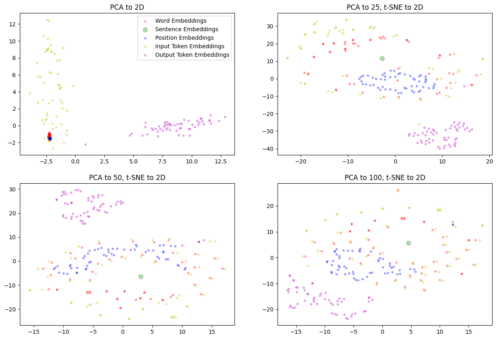
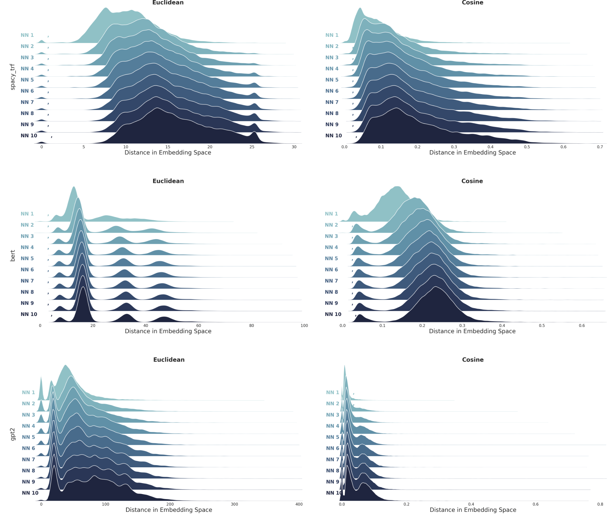
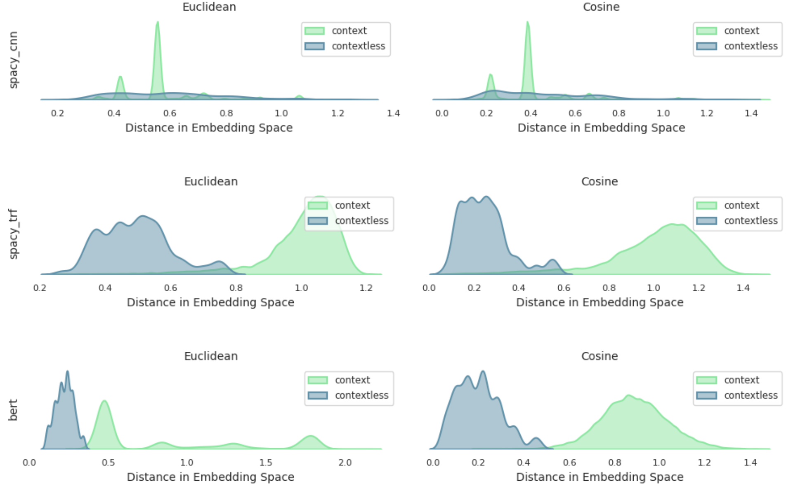

# spanish_verbs

## Project Aim

As my first project after a year of self studying a Master's in Data Science, this project aims to solidify relevant theory and practice relevant application techniques in the field of NLP. Although the main question is simple, the project intends to branch into side ideas to practice and iron out the application kinks in as many relevant topics as possible in the alloted time.

This project starts with a very simple idea: in English, verbs that start with "re", that also have a non-re counterpart (e.g., redo and do) mean "to do the verb again". As I've been learning Spanish over the past few months, I've noticed verbs that do and do not follow this rule, so the project aims to use the embedding space of pre-trained language models to explore the adherence of Spanish verbs to this rule.

## Project Summary

This project is split into three main sections:
1. Background Info
1. Data Sourcing, Probing and Cleaning
1. Exploratory Data Analysis

 

**Background Info**

First we clarify terminology of word embedding preprocessing steps, then go over word embedding model architecture types and attributes. We do a walkthrough of how data flows through a transformer model and visualize this change using PCA and T-SNE to reduce the embedding space dimensionality to 2D, and finish with an overview of some NLP libraries (FastText, SpaCy, HuggingFace).

 

**Data Sourcing, Probing and Cleaning**

We start by comparing a few Hugging Face datasets and note extremely useful API methods for data probing before data is even downloaded. Since our data is unlabelled, we find a suitable Parts-of-Speech labeler and test it on a smaller labelled dataset, as well as edge cases made from "industry knowledge" (i.e., some months of Duo Lingo and living in a Spanish speaking country, hehe). We perform a speed test to find the most efficient method for downloading and aggregating the data, based on API and python function options provided by Hugging Face. In batches, we download and label our text data, and convert verbs in and out of context into embedding for each word embedding model. Finally, we clean the text data by removing wrongly labelled verbs via regex functions, and remove zero vectors that represent out-of-vocabulary input text.

 

**Exploratory Data Analysis**

We start by considering the embedding space as a whole through two measures: vector distance to understand dispersion about the origin, and overlaid nearest neighbor distance distributions to understand the density of the embedding space.

Then, to compare semantically and contextually similar embeddings we plot the distribution of distances between (1) all contextual uses of a verb, and (2) contextual uses and the context-free embedding. We use the average distance between all embeddings, conditioned on contextual or non-contextual, as the baseline for these plots.

Finally, we answer the question of this project via a plot of the distribution of distances between re-verb pairs, conditioning on contextual and context free embeddings separately.

